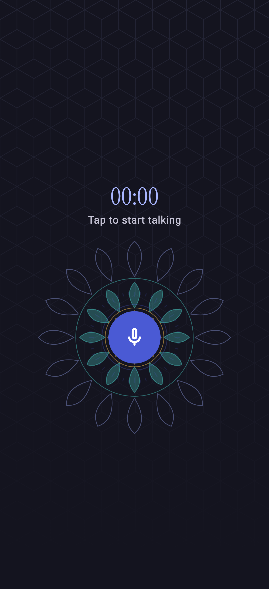
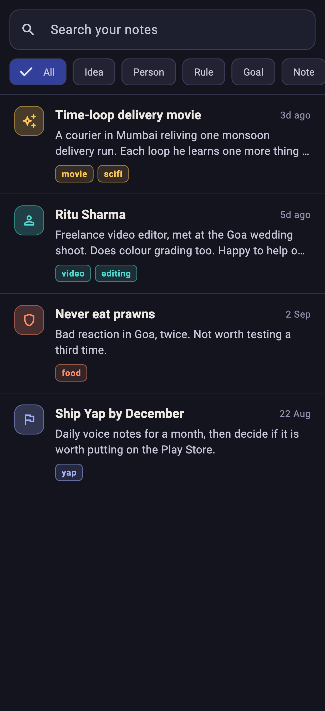
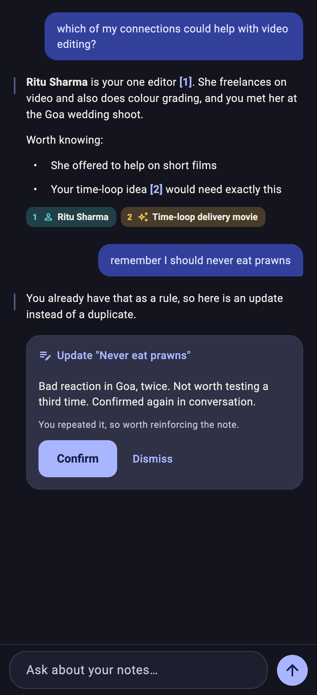
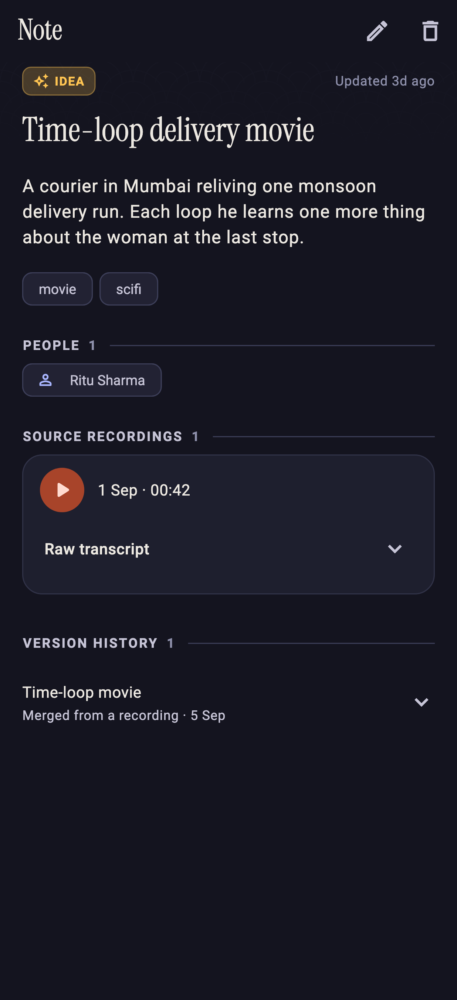
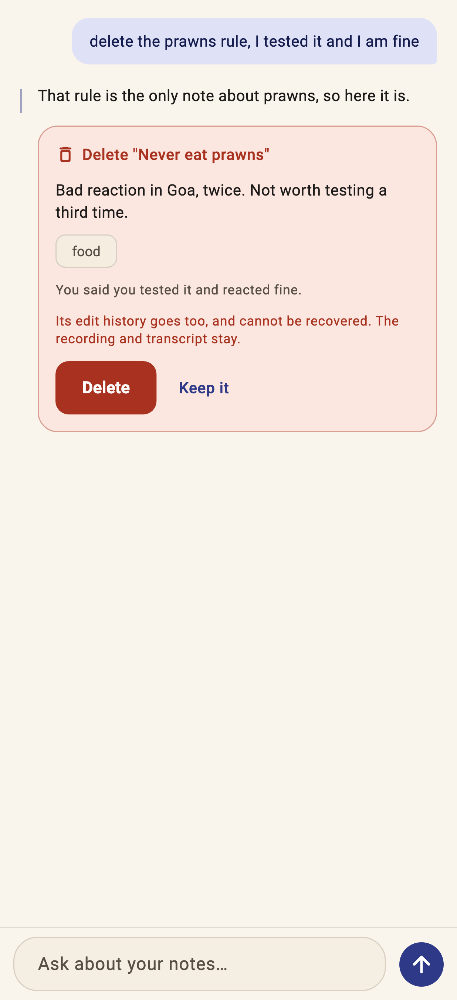
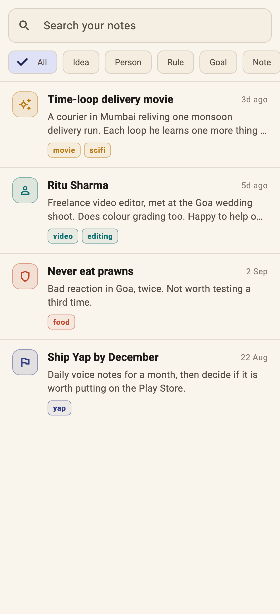

<div align="center">


# Yap

**Ramble into your phone. Get back notes you can actually ask questions of.**

Everything stays on the device.

</div>

---

Yap is a personal voice-memory app. You tap a mic and talk — in English, Hindi,
or the code-mixed Hinglish most people actually speak — and it turns the
rambling into clean, structured notes: ideas, people worth remembering, rules
you've set yourself, goals, and everything else.

Later you ask it things like *"which of my connections could help with video
editing?"* and it answers from your own notes, citing the ones it used.

No server, no account, no analytics. The database, the recordings and the API
keys never leave the phone unless you export them yourself.

<div align="center">


&nbsp;

&nbsp;


<sub>Capture · Notes · Chat</sub>

</div>

## What it does

**Capture.** One big mic button. The waveform lifts as you speak so you can
tell it's hearing you before you talk for three minutes into a dead mic.
Recordings are saved as AAC and kept forever — they're the source of truth.

**Structure.** The recording goes to [Sarvam](https://sarvam.ai) for
transcription (code-mixed Hindi/English), then to an LLM that splits it into
one note per distinct thought. One ramble can become three notes. You review
each as a card before anything is saved: **Save as new**, **Merge into an
existing note**, **Edit**, or **Discard**.

**Remember.** Notes are typed — idea, person, rule, goal, note — and the type
colours the list so it scans by hue before you read a word. Every note keeps
its version history, the recordings it came from, and links to the people it
mentions.

**Ask.** The chat searches your notes and answers from them, with tappable
citations back to the source. It can also propose creating, updating or
deleting a note — always behind a confirmation card, never silently.

> Chat answers **only** from your notes. If something isn't in them it says so
> and stops, rather than padding the answer with plausible general knowledge.

<div align="center">


&nbsp;

&nbsp;


<sub>Note detail · A confirmation card · Light mode</sub>

</div>

## How a recording becomes a note

```
  mic  ──>  recorded  ──>  transcribing  ──>  structuring  ──>  awaiting review
                              (Sarvam)          (your LLM)            │
                                                                      v
                                                            saved  <──┘
                                                          (you confirm)
```

The pipeline is resumable. Kill the app mid-transcription and it picks up on
next launch. Record with no signal and it queues, then finishes on its own when
the network returns. A genuine failure shows the real error and a Retry button,
and Retry reuses the transcript you already paid for.

## Setting it up

### 1. Build and install

Needs [Flutter](https://docs.flutter.dev/get-started/install) (stable) and an
Android device or emulator on API 24+.

```bash
git clone <your-remote> yapapp && cd yapapp
flutter pub get
dart run build_runner build          # generates the drift database code
flutter run                          # to a connected device
```

To produce an installable file instead:

```bash
flutter build apk --release --target-platform android-arm64
```

The APK lands at **`build/app/outputs/flutter-apk/app-release.apk`** (~23 MB).
Copy it to your phone and install it.

> The release build is signed with Flutter's debug keystore, which is fine for
> sideloading onto your own phone but not for the Play Store. Because the key
> never changes, a new build installs **over** the old one and keeps your
> notes. Changing the signing key later would require an uninstall, which
> wipes everything — so take a backup first if you ever do.

### 2. Add your keys

Open **Settings** (gear icon, top right) and fill in:

| | What | Where to get it |
|---|---|---|
| **Transcription** | Sarvam API key | [dashboard.sarvam.ai](https://dashboard.sarvam.ai) |
| **Language model** | Base URL, key, model | Any OpenAI-compatible endpoint |
| **Embeddings** | Base URL, key, model | Same; `text-embedding-3-small` is a good default |

Each section has a **Test connection** button, so you find out a key is wrong
in Settings rather than three seconds after a four-minute ramble.

Embeddings are optional but do more than they look like they do. Without them
you lose meaning-based search **and** merge suggestions entirely — the app can
only find notes whose exact words you typed. After adding them, tap **Index new
notes** once to catch up your existing notes.

Recording works before any of this is configured; the capture just fails with a
message telling you what's missing, and Retry picks it up once you've filled it
in. Your thought is never lost to a setup problem.

## Backing up

Settings → **Back up** produces one encrypted `.yapbackup` file and hands it to
the share sheet, so you can put it in Drive or mail it to yourself.

- **Argon2id + AES-256-GCM**, keyed from a passphrase you choose. There is no
  recovery — lose the passphrase and the file is gone.
- Notes, versions, people links and chat history. **Not** audio, which is the
  bulk of the bytes.
- **Restore** decrypts and fully validates before touching anything, shows you
  what the backup holds, and keeps a copy of your current database first.

API keys are **not** in a backup — they live in the Android keystore, which
can't be exported. Restoring onto a new phone brings all your notes; you re-enter
the three keys.

> Uninstalling the app deletes everything on the phone. Android's own backup is
> deliberately switched off, so an export is the only copy that survives.

## Under the hood

| | |
|---|---|
| State | Riverpod |
| Database | drift (SQLite) with an FTS5 index kept in sync by triggers |
| Search | FTS5 BM25 + brute-force cosine over embeddings, fused with Reciprocal Rank Fusion |
| Audio | `record` (AAC, 16 kHz mono) and `just_audio` |
| Crypto | `cryptography` — Argon2id, AES-256-GCM |

Heavy work runs off the UI thread: cosine similarity and backup encryption in
isolates, large JSON responses decoded by Dio's background transformer.

The design leans on what Indian and Japanese traditions genuinely share —
indigo is both *neel* and *ai*, vermillion both *sindoor* and *shu*, and the
lotus is drawn radially in both. Japanese restraint in the layout, Indian
saturation in the colour.

## Development

```bash
flutter analyze
flutter test                    # 364 tests

# Re-render the screenshots in this README
flutter test test/ui/preview_test.dart --update-goldens --run-skipped

# Regenerate the launcher icons from lib/ui/common/yap_logo.dart
flutter test test/tool/generate_icons_test.dart --run-skipped
```

`SPEC.md` is the source of truth: the original brief, plus a numbered log of
every implementation decision and the verified Sarvam API contracts. Read it
before changing anything non-obvious — several entries exist because the
obvious approach was tried and broke something.

## Status

Capture, search, chat, merge and backup all work. Remaining: hardening the
offline queue, re-transcribing an existing recording, and a performance pass on
a mid-range device.

Android only for now. The code is iOS-clean but iOS builds aren't set up.
